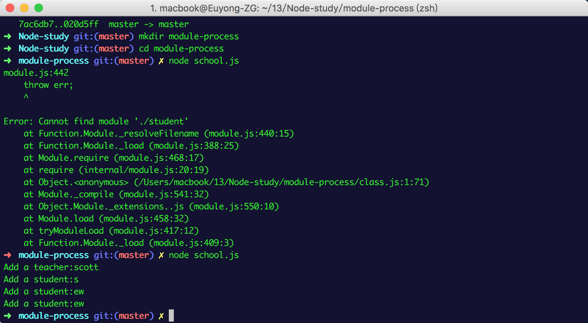

#module process

##create module
```
	function add (stu) {
		console.log('Add a student:' + stu);
	}

	exports.add = add;
```	

##exports module

	module.exports = add;

	exports.add = add;

##require module

	let s = require('./student');

	let t = require('./teacher');
	

##use module

	let c = require('./class');
	
	c.add('scott', ['s', 'ew', 'ew']);


##result
```
	
```